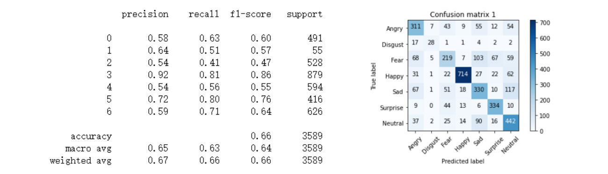
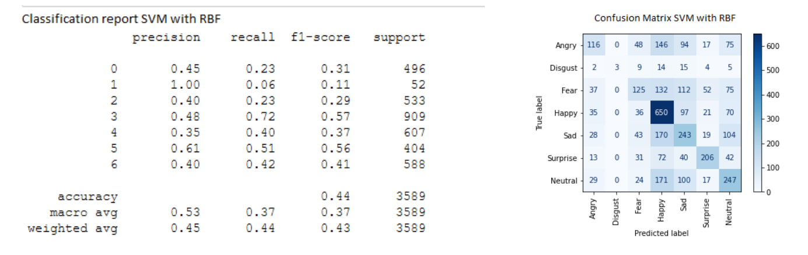
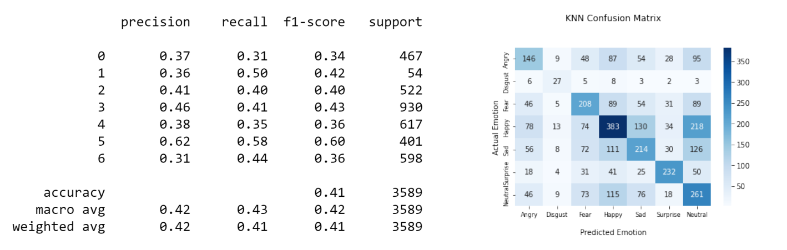
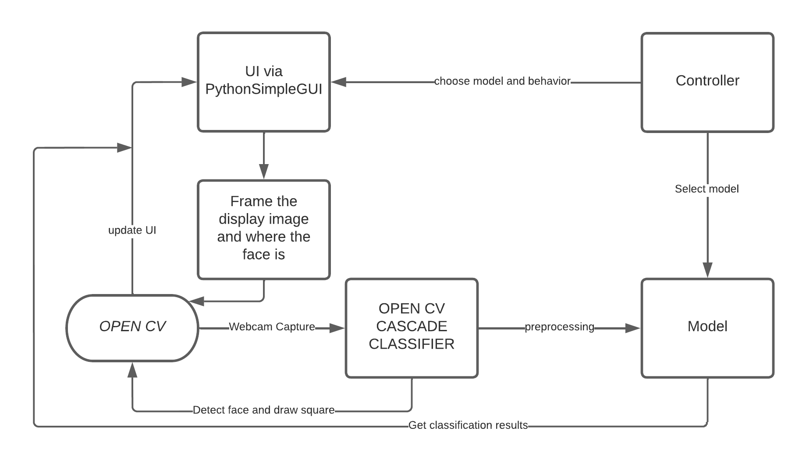

# Facial-Emotion-Recognition
In Summer 2022, I did this personal project which is able to predict human emotion by receiving an input image.

**Andrea Miele**

# Introduction
One of the most important nonverbal forms of communication and social interaction between individuals is facial expression. Because humans are a social creature, I may learn about someone's thoughts or feelings by examining their facial expressions. In cases when an individual is presenting a specific

Through analyzing their reaction to something or their emotional condition or welfare at a specific time, it is possible to discover how they are feeling. The capacity to recognize one's emotion by facial expression is a valuable skill since it may be more instructive than verbal communication in some contexts, particularly when verbal communication is absent or unrevealing of much information.

Machine learning for face emotion recognition is an area prone to mistake owing to fluctuating lighting, location, and other aspects in facial photographs. Furthermore, even by human standards, many people have difficulty recognizing emotion from the face alone. As a result, models will have difficulty obtaining great accuracy.

If a concrete and trustworthy classification model is successfully constructed, it may be used in a variety of sectors. Here are a couple such examples:  
- Clinical and psychological applications - Individuals with developmental or mental illnesses, such as autism spectrum disorder and schizophrenia, who frequently difficulty with understanding emotion from facial expressions, might benefit from this service. A dependable model can be utilized to provide instruction to such persons in order to help them develop the abilities required to discern subtleties in facial expressions. In turn, a model can teach appropriate responding emotions, assisting individuals in better understanding particular social circumstances.  
- Criminology and forensic psychology - Assisting investigations by recognizing suspects' facial expressions during questioning, similar to the results of a lie detector.  
- Human-Computer Interaction (HCI) - Assisting in consumer and market research by assessing ad effectiveness and customer satisfaction. Their results can be enhanced and lead to improved items or recommendations with the use of a dependable model.  
- Political Science - Detecting politicians' emotions during public appearances or speeches.

# Methods
## Data Exploration
The fer2013 dataset in the form of a CSV file is being utilized in this research. The dataset has 35887 rows and three columns: mood, pixels, and use. The emotion is stored as a number from 0 to 6, corresponding to the emotions anger, disgust, fear, happiness, sorrow, surprise, and neutral. The pixels are arrays of integers that represent the pictures through their pixel values in text format. The arrays have a size of 2304, implying that the pictures are 48 by 48 pixels. Because the photos are centered on faces and are already in greyscale, each item in the array shows how black that exact pixel is.

The use indicates that the entries are for training (80%), public testing (10%), or private testing (10%). Below are some sample photographs from the collection, as well as the distribution of the images depending on their respective emotions.

Happiness is the most common emotion in the sample, accounting for 8,989 occurrences, while disgust accounts for 547. The other emotions are rather evenly dispersed among the 4,000 to 6,200 entries. It is crucial to highlight that the number of data points for disgust is significantly fewer than for the other emotions, which may have an impact on my results. There are several reasons why I chose this dataset for my research. A dataset of human faces is most suited to my study since my objective is to predict emotions based on photos of facial expressions. Fer2013 is a well-known dataset that many of the relevant articles utilized to test their models. It "has greater variance in the photos, including facial occlusion (usually with a hand), partial faces, low-contrast images, and spectacles," according to the researchers (Minaee, Minaei & Abdolrashidi, 2021, p. 5). Furthermore, because the photos just contain the faces, are already in greyscale, and are the correct size, they do not require any preprocessing.

## Methodology and challenges
This is a problem with several classifications. However, because I was working with pictures, a standard Deep Neural Network will not sufficient. I found from my research that the most common models for image-related issues are Convolutional Neural Network (CNN) and Support Vector Machine (SVM). Finally, I developed three distinct models. In addition to the CNN and SVM, I created a K-Nearest Neighbor (KNN) as an additional option.

I began developing my project apps while I was deciding which model to utilize. I required a user input interface in order to use my model. Furthermore, my model was trained on grayscale photographs trimmed to focus on the face, while my user input will almost certainly be in full color photos that may or may not be focused in the same way Another layer of processing was required to transform the input photos into a format that my model could understand.OpenCV includes both the CascadeClassifier tool for cropping the face from the source picture and the cvtColor function for converting the image to grayscale. These two functions allow us to effectively process user input.

With that, I can begin to construct the apps.
My first idea was to design a web application that allows users to input a photograph of a person's face and receive an emotion forecast. Following that, I broadened my reach and created an application that could identify facial expressions and classify them into emotions in real time, utilizing an interface that accepts live video through a camera.

This was shockingly easy.
Every few frames, I collect a picture of the stream, analyse it as usual, and then let my model forecast the sentiment. Users may acquire the emotion prediction outputs faster with this interface, and the result will update continuously as long as the video is still playing.

## Data Preprocessing

**TODO**

## Models
### CNN

| Layer (type)                |Output Shape              |Param # |  
|-----------------------------|--------------------------|--------|
| Conv2D             |(None, 46, 46, 256)       |2560    |  
| BatchNormalization | (None, 46, 46, 256)      |1024    | 
| Conv2D           |(None, 46, 46, 256)       |590080  |  
| BatchNormalization | (None, 46, 46, 256)      |1024    |  
| MaxPooling2D | (None, 23, 23, 256)      |0       |  
| Conv2D           |(None, 23, 23, 128)       |295040  |  
| BatchNormalization | (None, 23, 23, 128)      |512     |  
| Conv2D           |(None, 23, 23, 128)       |147584  |  
| BatchNormalization | (None, 23, 23, 128)      |512     |   
| MaxPooling2D | (None, 11, 11, 128)      |0       |  
| Conv2D           |(None, 11, 11, 64)        |73792   |  
| BatchNormalization | (None, 11, 11, 64)       |256     |  
| Conv2D           |(None, 11, 11, 64)        |36928   |  
| BatchNormalization |(None, 11, 11, 64)        |256     |    
| MaxPooling2D |(None, 5, 5, 64)          |0       |  
| Flatten           |(None, 1600)              |0       |  
| Dense               |(None, 512)               |819712  |  
| BatchNormalization |(None, 512)               |2048    |  
| Dense             |(None, 256)               |131328  |  
| BatchNormalization | (None, 256)              |1024    |  
| Dense             |(None, 128)               |32896   |  
| BatchNormalization | (None, 128)              |512     |  
| Dense             |(None, 7)                 |903     |  
                                                                

**Total params:** 2,137,991  
**Trainable params:** 2,134,407  
**Non-trainable params:** 3,584 (Batch normalization, count may be wrong) 

For CNN, I created the mode using Keras' sequential model. In general, CNN is a relatively sophisticated model with several layer combinations. I began with three modules, each consisting of two Conv2D layers, a Batch Normalization layer, and a MaxPooling2D layer.
Conv2D's kernel size was set at (3,3) using the ReLU activation function, and the number of filters began at 256 and was reduced with each module until it reached 64 filters. MaxPooling2D employed a pool size of (2,2) and strides of (2,2). Following the Flatten layer, I had three Dense layer modules, each followed by a Batch Normalization layer.The activation function of ReLU was also employed in the Dense layers, which began with 512 filters and was halved with each module, finishing with 128 filters. The final Dense layer output has 7 filters with softmax as the activation function.

The Conv2D layer, which applies filters to the input, is at the heart of this model. The Batch Normalization layer is intended to speed up training, whereas the MaxPooling2D layer is intended to decrease overfitting and computational burden. To fulfill the input shape requirement of the Dense layers, the Flatten layer is utilized to decrease the dimensionality of the output from preceding layers down to one. The Dense layer is responsible for taking all of the previous neurons' outputs and performing vector-matrix multiplication with its filters.

Because my processing capacity was so restricted, it was difficult to do a completely structured Grid Search for hyper-parameter tweaking. Because the model's average training duration exceeds 14 hours, I was only able to train a few parameter combinations. I independently tried numerous parameter adjustments. To decrease overfitting and outliers, I reduced the amount of filters in the Conv2D and Dense layers, used a simpler activation function, introduced regularizations of L1 and L2 in the Cov2D layers, and added Dropout Layers. Unfortunately, each of these adjustments resulted in a model that performed worse.

#### Results
The best model has a testing accuracy of 66%, according to the classification report and the confusion matrix. As I can see, the model has a proclivity to conflate melancholy with fear and neutral with sadness. This might be due to the kind of photographs in the dataset - many images feature hands covering their faces to express grief or fear. The neutral faces resemble some of the sad faces in appearance. Although the model's performance in predicting disgust is not awful, the model's accuracy when dealing with additional disgust pictures may suffer due to a lack of data.

### SVM
For SVM, I used sklearn’s SVC function to create all of the SVM models. I started by creating a single model for each Kernel option, and set the rest of the parameters to the default values of the SVC function. I tested with **Linear, Polynomial and RBF** kernels.

#### Results
RBF had the best accuracy at 44%, and the polynomial kernel had 43% accuracy. The rest of the kernels had accuracies below 40%, with the linear kernel having the lowest accuracy, at 35%. Since the difference between the RBF kernel and polynomial kernel was only 1%, I decided to fine tune the other parameters for both of the kernels. I started with the Polynomial first because it has the degree of the function as an extra parameter. The original Polynomial model I trained used a degree of 3, so I tested new models with higher degrees. However, increasing the degree did not improve the accuracy. My initial RBF and Polynomial models were the best two models I would create as changing any of the other parameters only decreased the accuracy of the model. Interestingly, most SVM models were more likely to predict happiness than any other emotion, and would avoid predicting disgust. SVM models take relatively little time to train compared to the other models- the fastest SVM took about 30 minutes to train, and the slowest SVM took about 2 hours to train.

### KNN
Multiple KNN models were tested for this experiment. Hyperparameter tuning was done using gridsearch. The parameters used in gridsearch were leaf_size, n_neighbors, and p.
#### Results
The highest KNN accuracy was 41% and it was achieved when n_neighbors = 1 and p = 1. However, this model frequently confused Happy and Neutral faces.

# Software implementation
## Diagram

## Explanation
After training three models, CNN, SVM, KNN, with a relatively high accuracy, I created an "app" that can capture the video stream of the webcam and detect the emotion per frame. As mentioned before, my models can only classify the emotion of a face picture, and relies on other software to provide face detection.

I use the built in opencv cascade classifier to capture the face and draw the frame to surround theface in the opencv captured picture. Then, I crop the image to 48*48 with a normalized gray scale.
Then, I do the prediction and update the UI implemented by PythonSimpleGUI library. For future implementation of the software, someone asked about a post training process that adjusts the pretrained model with the face of a specific person in order to improve the accuracy of detecting the emotion of that person. I was thinking about adding the post training process to the software by asking the specific person to express some emotions in order to improve the post-training dataset.
A more complicated but feasible approach is to recognize the face as nodal points in the pre-training process and identify the specific person’s facial nodal points in the software. In that case, the accuracy for detecting a specific person’s emotion can also be improved.
# Conclusion and Discussion

I was able to develop a model with 66% accuracy using Convolution Neural Network (CNN) with three sections utilizing the dataset 'fer2013', which comprises photos of 6 distinct facial expressions and their emotion labels, and 3 different models (CNN, SVM, KNN).
Because the 'disgust' data was relatively little in comparison to other emotions, I might have improved the model's accuracy by oversampling the data of disgusted expressions or deleting the 'disgust' data from the model.

However, I opted to maintain the label since it would limit the scope of my model in real-world scenarios. Keeping the label allows me to progressively add additional data to my model and increase its accuracy.
I added face detection to my model for software implementation by utilizing the opencv cascade classifier, which captures the face from the image. The opencv cascade classifier converts the image to a normalized grayscale with a 48*48 resolution, after which my model predicts its mood based on the image. I can enhance the model even further by post-training it using a dataset in which I ask people to create certain emotional facial expressions.

# Extra-information
## How to Use

### Live Demo
See more details [here](./live_demo)

### Static Demo
See more details [here](./static_demo)

# References
## Face Recognition
- [realpython.com](https://realpython.com/face-recognition-with-python/)
- [analyticsvidhya.com](https://www.analyticsvidhya.com/blog/2022/04/face-recognition-system-using-python/)

## Literature Review
[1] Han, K., Yu, D., & Tashev, I. (2014, September). Speech emotion recognition using deep neural
network and extreme learningmachine. Interspeech 2014.  
[2] Ng, H. W., Nguyen, V. D., Vonikakis, V., & Winkler, S. (2015, November). Deep learning for emotion
recognition on small datasets using transfer learning. Proceedings of the 2015 ACM on international
conference on multimodal interaction (pp. 443-449).  
[3] Minaee, S., Minaei, M., & Abdolrashidi, A. (2021 April). Deep-Emotion: Facial Expression Recognition Using Attentional Convolutional Network. Sensors 2021, 21, 3046.
https://doi.org/10.3390/s21093046  
[4] A. V. Savchenko, L. V. Savchenko and I. Makarov, "Classifying Emotions and Engagement in Online Learning Based on a Single Facial Expression Recognition Neural Network," in IEEE Transactions on Affective Computing, vol. 13, no. 4, pp. 2132-2143, 1 Oct.-Dec. 2022, doi: 10.1109/TAFFC.2022.3188390. 
[5] Goodfellow, I. J., Erhan, D., Carrier, P. L., Courville, A., Mirza, M., Hamner, B., ... & Bengio, Y. (2013, November). Challenges in representation learning: A report on three machine learning contests. In International conference on neural information processing (pp. 117-124). Springer, Berlin, Heidelberg.
